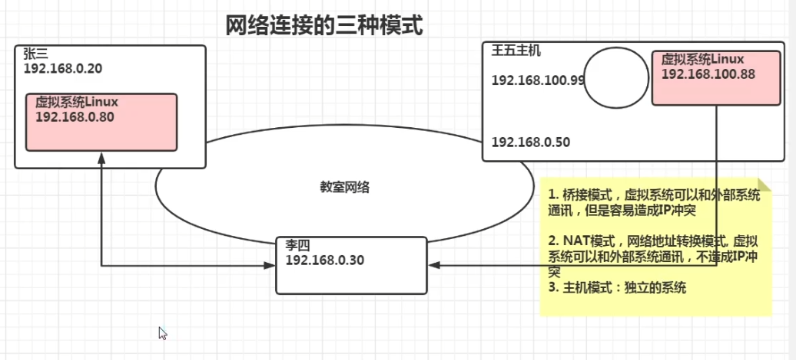
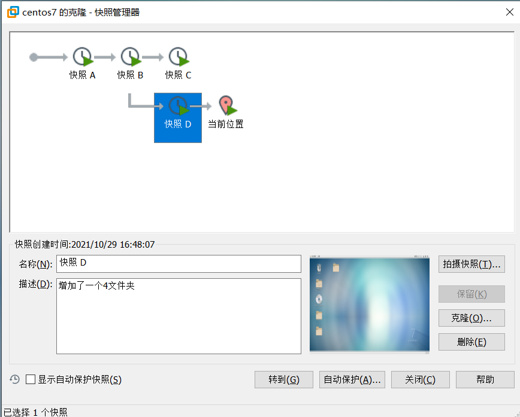
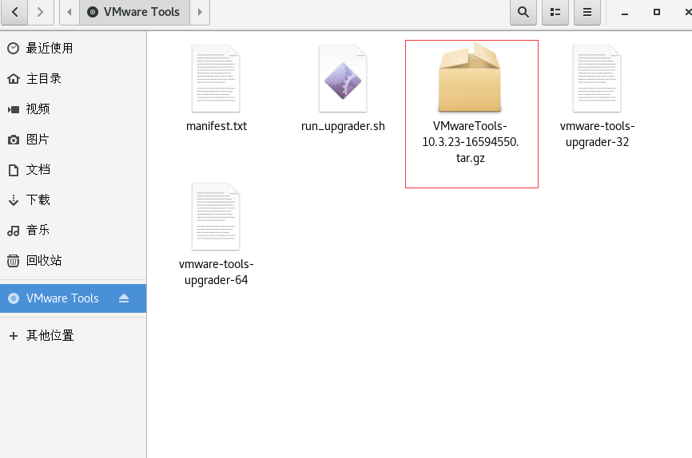
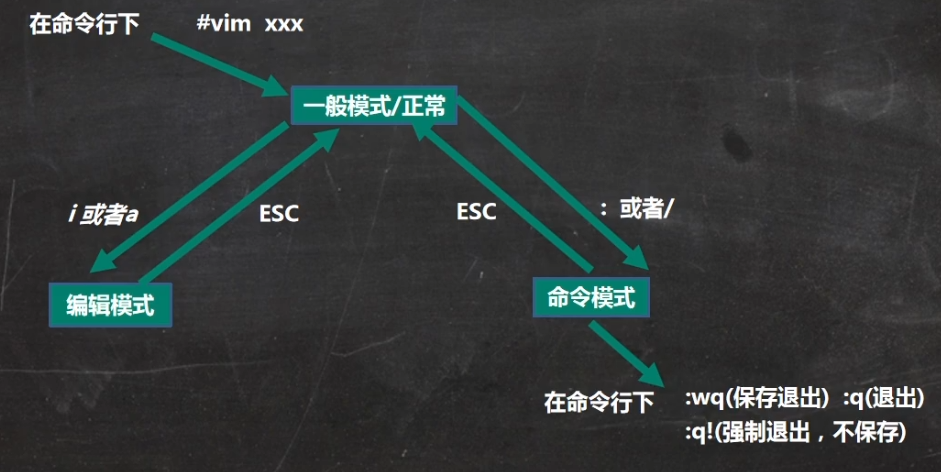
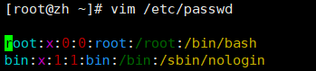
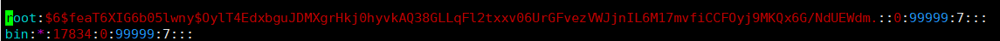

# linux 入门笔记

# 网络连接的三种模式

1. 桥接模式：虚拟系统可以和外界直接通讯，容易造成IP冲突
2. NAT模式：网络地址转换模式，虚拟系统可以和外部系统通讯，不造成IP冲突；但只能从虚拟系统访问外界，外界无法访问虚拟机
3. 主机模式：独立的系统

# 虚拟机快照

在使用虚拟机时，如果想回到某一个状态，也就是说你担心可能某些误操作可能造成系统异常，需要回到原先某个正常运行的状态

# 共享文件

方式一：vmtools

1. 最高权限进入系统，重新安装VMware Tools，进入VMwareTools目录，将**.tar.gz拷贝到opt目录下
2. 打开终端，（cd /opt）进入opt目录下，（tar -zxvf **.tar.gz）解压并进入，（./vmware-install.pl）安装

# 目录详解
~~~text
/bin 存放最常使用的命令
/sbin 存放系统管理员使用的系统管理程序
/home 存放普通用户的主目录，在linux中每个用户都有一个主目录
/root 该目录为系统管理员，也称为超级权限者的用户主目录
/lib 系统开机所需要最基本的动态连接共享库，作用类似于win里的DLL文件，几乎所有应用程序都需要用到这些共享库
/etc 所有的系统管理所需的配置文件和子目录
/usr 这是一个非常重要的目录，用户的很多应用程序和文件都放在这个目录下，类似win下的program files目录
/boot 存放linux启动文件，包括一些连接文件和镜像文件
/dev 类似win的设备管理器，把所有的硬件用文件形式存储
/media linux系统会自动识别一些设备，例如u盘、光驱，linux会把识别的设备挂载到这个目录下
/mnt 系统提供该目录是为了让用户临时挂载别的文件系统的，我们可以将外部的存储挂载在/mnt/上
/opt 这是给主机额外安装软件所存放的目录，如安装ORACLE数据库就可放到该目录下，默认为空
/usr/local 这是另一个给主机额外安装软件所安装的目录，一般是通过编译源码方式安装的程序
/var 存放不断扩充的东西，习惯将经常被修改的目录放到这个目录下，包括各种日志
~~~

# vim

## vim的三种模式

1. 正常模式
   * 以vim打开一个档案就直接进入一般模式了（默认模式），在这个模式中，可以使用【上下左右】按键来移动光标，
可以使用【删除字符】或【删除整行】来处理内容，也可以使用【复制、黏贴】来处理文件数据

2. 插入模式
   * 按下i进入编辑模式

3. 命令行模式
   * 在编辑模式下，按Esc键，再按 冒号: 或 斜杠/，后面跟上命令
在这个模式中，可以提供你相关的指令，完成读取、存盘、替换、离开vim、显示行号等动作

## 快捷键使用
~~~text
1.一般模式下
拷贝当前行：yy，拷贝多行：5yy
删除当前行：dd，删除多行：5dd
到末行：G，到首行：gg
撤销：u
移动到指定行：输入行号+shift+g

2.命令行模式下
查找某个单词：/关键字，回车查找，按n下一个
设置文件行号:(:set nu 或 :set nonu)

~~~

# 用户管理

## 开关机指令
~~~text
立刻关机：shutdown -h now 
一分钟后关机：shutdown -h 1 
现在重启：shutdown -r now 
关机：halt 
重启：reboot 
把内存的数据同步到磁盘：sync 

注意：
1.不管是重启还是关闭系统，首先要运行sync命令，把内存中的数据写到磁盘中
~~~

## 用户登录和注销
~~~text
1.普通用户切换系统管理员：su -系统管理员名
2.注销用户：logout，logout注销指令在图形运行级别无效，在运行级别下有效
~~~

## 添加和删除用户
~~~text
查询用户：id 用户名

添加用户：useradd 用户名，默认该用户的家目录在 /home 下
修改密码：passwd 用户名
显示当前用户所在目录：pwd

删除用户保留家目录：userdel 用户名
删除用户并删除家目录：userdel -r 用户名
~~~

## 用户组
~~~text
用户组介绍：类似于角色，系统可以对有共性、权限的多个用户进行统一管理
新增组：groupadd 组名
删除组：groupdel 组名
修改用户的组：usermod -g 用户组 用户名
增加用户时直接加上组：useradd -g 用户组 用户名
~~~

## 用户和相关信息
~~~text
/etc/passwd 用户的配置文件，记录用户的各种信息
每行的含义：用户名：口令：用户标识符：组标识符：注释行描述：主目录：登录Shell

/etc/shadow 口令的配置文件
每行的含义：登录名：加密口令：最后一次修改时间：最小时间间隔：最大时间间隔：警告时间：不活动时间：失效时间：标志

/etc/group
组（group）的配置文件，记录Linux包含的组信息
每行的含义：组名：口令：组标识号：组内用户列表

~~~

# 实用指令

## 指定运行级别
~~~text
0:关机
1：单用户【找回丢失密码】
2：多用户下状态没有网络服务
3：多用户下有网络服务
4：系统未使用保留给用户
5：图形界面
6：系统重启

进入指定运行级别：init 数字
常用运行的是3和5，也可以指定默认运行级别

~~~

## 设置运行级别
~~~text
在SentOS7之前，在/etc/initab文件中设置
在SentOS7之后，进行了简化，如下：

级别3：multi-user.target
级别5：graphical.target

查看当前级别：systemctl get-default

设置默认指令：systemctl set-default *.target
~~~

## 找回root密码
~~~text
CentOS7以后，找回root密码方式

1.系统开机按e进入编辑界面，找到 "Linux16" 开头那行，在后面输入：init=/bin/sh，按下ctrl+x，表示进入 单用户模式
2.进入单用户模式后，输入：mount -o remount,rw / 回车
3.passwd 修改密码
4.再输入：touch /.autorelabel 回车
5.再输入：exec /sbin/init 回车，等待较长时间重启
~~~

## 帮助指令
~~~text
man 获得帮助信息
    语法：man [命令或配置文件]
    例如：man ls 查看列出文件ls帮助信息

~~~

## 文件目录类

|  符号   | 表示  | 
|  :----  | ----  |
| pwd  | 显示当前目录的绝对路径 |
| cd ~  | 回到自己的家目录，比如root，cd ~，返回到/root |
| cd ../../root  | 使用相对路径到指定路径 |
| mkdir  | 创建目录 | 
| rm | 删除文件 |
| rm -r | 递归删除整个目录，一个一个提示 |
| rm -f | 强制删除文件，不提示 |
| rm -rf  | 删除非空目录和文件，不提示 |
| rmdir | 删除指定空目录 |
| cp  | 拷贝文件到指定文件夹 |
| cp -r  | 递归复制整个文件夹（从根目录开始） |
| \cp   | 强制覆盖不提示 |
| touch  | 创建空文件 |
| mv  | 移动文件与目录（需要写出绝对路径） 或 重命名 |
| cat -n | 查看文件内容，显示行号，不能修改，安全 |
| less | 分屏查看文件内容，q 离开程序，/ 查找内容，n 向下查找，N 向上查找|
| echo | 输出内容到控制台，例如 echo $HOSTNAME ，echo "hello"|
| head | 显示文件开头部分内容，默认前十行，head -n 5 显示五行|
| tail | 输出文件尾部内容 |
| " > " | 输出重定向，会覆盖，可当复制粘贴用 |
| " >> " | 输出重定向，追加 |
| ln -s | 软连接（快捷方式），存放链接其他文件的路径 |
| history | 查看已经执行过的历史指令，也可以执行历史指令（!历史编号） |

