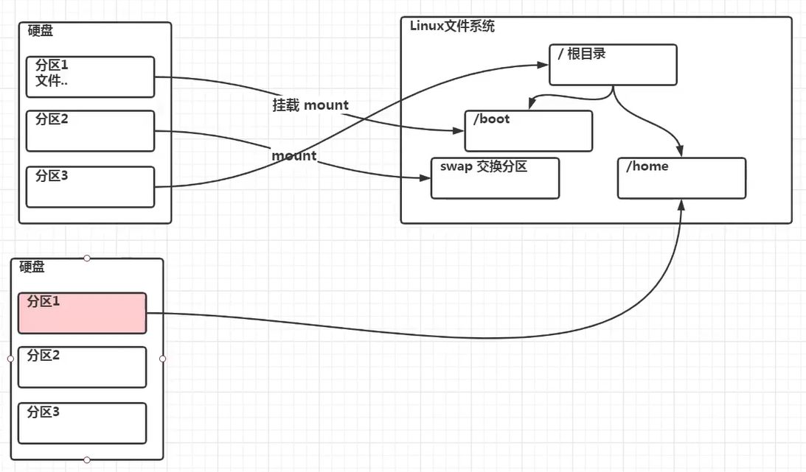
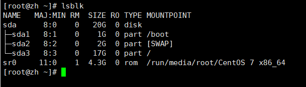
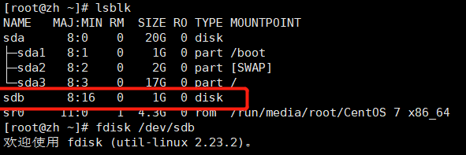
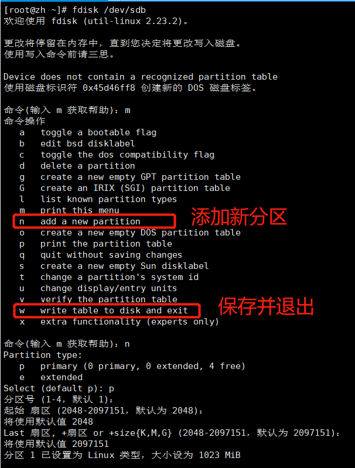
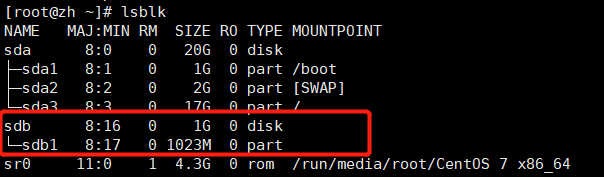
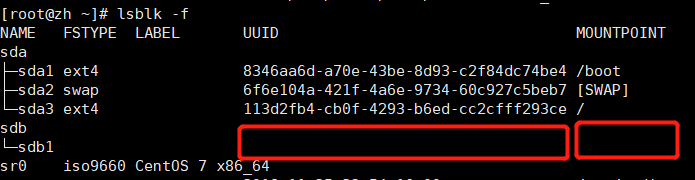
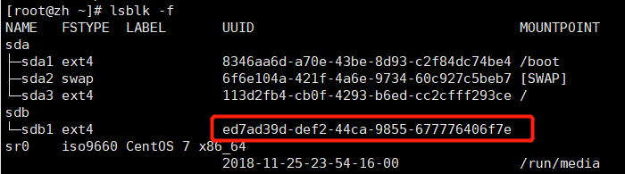
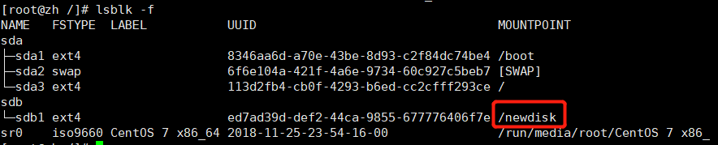

#linux 入门笔记

# 网络连接的三种模式

1. 桥接模式：虚拟系统可以和外界直接通讯，容易造成IP冲突
2. NAT模式：网络地址转换模式，虚拟系统可以和外部系统通讯，不造成IP冲突；但只能从虚拟系统访问外界，外界无法访问虚拟机
3. 主机模式：独立的系统

# 虚拟机快照

在使用虚拟机时，如果想回到某一个状态，也就是说你担心可能某些误操作可能造成系统异常，需要回到原先某个正常运行的状态

# 共享文件

方式一：vmtools

1. 最高权限进入系统，重新安装VMware Tools，进入VMwareTools目录，将**.tar.gz拷贝到opt目录下
2. 打开终端，（cd /opt）进入opt目录下，（tar -zxvf **.tar.gz）解压并进入，（./vmware-install.pl）安装

# 目录详解
~~~text
/bin 存放最常使用的命令
/sbin 存放系统管理员使用的系统管理程序
/home 存放普通用户的主目录，在linux中每个用户都有一个主目录
/root 该目录为系统管理员，也称为超级权限者的用户主目录
/lib 系统开机所需要最基本的动态连接共享库，作用类似于win里的DLL文件，几乎所有应用程序都需要用到这些共享库
/etc 所有的系统管理所需的配置文件和子目录
/usr 这是一个非常重要的目录，用户的很多应用程序和文件都放在这个目录下，类似win下的program files目录
/boot 存放linux启动文件，包括一些连接文件和镜像文件
/dev 类似win的设备管理器，把所有的硬件用文件形式存储
/media linux系统会自动识别一些设备，例如u盘、光驱，linux会把识别的设备挂载到这个目录下
/mnt 系统提供该目录是为了让用户临时挂载别的文件系统的，我们可以将外部的存储挂载在/mnt/上
/opt 这是给主机额外安装软件所存放的目录，如安装ORACLE数据库就可放到该目录下，默认为空
/usr/local 这是另一个给主机额外安装软件所安装的目录，一般是通过编译源码方式安装的程序
/var 存放不断扩充的东西，习惯将经常被修改的目录放到这个目录下，包括各种日志
~~~

# vim

## vim的三种模式

1. 正常模式
   * 以vim打开一个档案就直接进入一般模式了（默认模式），在这个模式中，可以使用【上下左右】按键来移动光标，
可以使用【删除字符】或【删除整行】来处理内容，也可以使用【复制、黏贴】来处理文件数据

2. 插入模式
   * 按下i进入编辑模式

3. 命令行模式
   * 在编辑模式下，按Esc键，再按 冒号: 或 斜杠/，后面跟上命令
在这个模式中，可以提供你相关的指令，完成读取、存盘、替换、离开vim、显示行号等动作

## vim快捷键使用
1. 一般模式下
~~~text
拷贝当前行：yy
拷贝多行：5yy
删除当前行：dd
删除多行：5dd
到末行：G
到首行：gg
撤销：u
移动到指定行：输入行号+shift+g
~~~
2. 命令行模式下
~~~textmate
查找某个单词：/关键字，回车查找，按n下一个
设置文件行号:(:set nu 或 :set nonu)
~~~
# 用户管理指令

## 开关机指令
| 符合 | 表示 |
| :---- | ---- |
| shutdown -h now | 立刻关机 |
| shutdown -h 1 | 一分钟后关机 |
| shutdown -r now | 现在重启 |
| halt | 关机 |
| reboot | 重启 |
| sync | 把内存的数据同步到磁盘 |

## 用户登录和注销
| 符合 | 表示 |
| :---- | ---- |
| su | 普通用户切换系统管理员 |
| logout | 注销用户，logout注销指令在图形运行级别无效，在运行级别下有效 |

## 添加和删除用户
| 符合 | 表示 |
| :---- | ---- |
| id | 查询用户 |
| useradd | 添加用户，默认该用户的家目录在 /home 下 |
| passwd | 修改密码 |
| pwd | 显示当前用户所在目录 |
| userdel | 删除用户保留家目录 |
| userdel -r | 删除用户并删除家目录 |

## 用户组
| 符合 | 表示 |
| :---- | ---- |
| groupadd | 新增组 |
| groupdel | 删除组 |
| usermod -g 用户组 用户名 | 修改用户的组 |
| useradd -g 用户组 用户名 | 添加用户时直接加上组 |
| cat -n etc/group | 查看所有组

## 用户和相关信息
| 符合 | 表示 |
| :---- | ---- |
| /etc/passwd | 用户的配置文件，记录用户的各种信息，每行的含义：用户名：口令：用户标识符：组标识符：注释行描述：主目录：登录Shell |
| /etc/shadow | 口令的配置文件，每行的含义：登录名：加密口令：最后一次修改时间：最小时间间隔：最大时间间隔：警告时间：不活动时间：失效时间：标志 |
| /etc/group | 组（group）的配置文件，记录Linux包含的组信息，每行的含义：组名：口令：组标识号：组内用户列表 |

#实用指令

##指定运行级别
~~~text
0:关机
1：单用户【找回丢失密码】
2：多用户下状态没有网络服务
3：多用户下有网络服务
4：系统未使用保留给用户
5：图形界面
6：系统重启

进入指定运行级别：init 数字

常用运行的是 3 和 5，也可以指定默认运行级别
~~~

##设置运行级别

在SentOS7之前，在/etc/initab文件中设置

在SentOS7之后，进行了简化，如下：

|  符号   | 表示  |
|  :----  | ----  |
| multi-user.target | 级别3 |
| graphical.target | 级别5 |
| systemctl get-default | 查看当前级别 |
| systemctl set-default *.target | 设置默认指令 |

## 找回root密码
CentOS7以后，找回root密码方式
~~~text
1.系统开机按e进入编辑界面，找到 "Linux16" 开头那行，在后面输入：init=/bin/sh，按下ctrl+x，表示进入 单用户模式
2.进入单用户模式后，输入：mount -o remount,rw / 回车
3.passwd 修改密码
4.再输入：touch /.autorelabel 回车
5.再输入：exec /sbin/init 回车，等待较长时间重启
~~~

##帮助指令
~~~text
man 获得帮助信息
    语法：man [命令或配置文件]
    例如：man ls 查看列出文件ls帮助信息
~~~

##文件目录类

|  符号   | 表示  | 
|  :----  | ----  |
| pwd  | 显示当前目录的绝对路径 |
| cd ~  | 回到自己的家目录，比如root，cd ~，返回到/root |
| cd ../../root  | 使用相对路径到指定路径 |
| mkdir  | 创建目录 | 
| rm | 删除文件 |
| rm -r | 递归删除整个目录，一个一个提示 |
| rm -f | 强制删除文件，不提示 |
| rm -rf  | 删除非空目录和文件，不提示 |
| rmdir | 删除指定空目录 |
| cp  | 拷贝文件到指定文件夹 |
| cp -r  | 递归复制整个文件夹（从根目录开始） |
| \cp   | 强制覆盖不提示 |
| touch  | 创建空文件 |
| mv  | 移动文件与目录（需要写出绝对路径） 或 重命名 |
| cat -n | 查看文件内容，显示行号，不能修改，安全 |
| less | 分屏查看文件内容，q 离开程序，/ 查找内容，n 向下查找，N 向上查找|
| echo | 输出内容到控制台，例如 echo $HOSTNAME ，echo "hello"|
| head | 显示文件开头部分内容，默认前十行，head -n 5 显示五行|
| tail | 输出文件尾部内容 |
| " > " | 输出重定向，会覆盖，可当复制粘贴用 |
| " >> " | 输出重定向，追加 |
| ln -s | 软连接（快捷方式），存放链接其他文件的路径 |
| history | 查看已经执行过的历史指令，也可以执行历史指令（!历史编号） |

## 时间日期类

|  符号   | 表示  | 
|  :----  | ----  |
| date | 显示当前时间 |
| date +%Y | 显示当前年份 |
| date +%m | 显示当前月份 |
| date +%d | 显示当前天 |
| date +"%Y-%m-%d %H:%M:%S" | 显示年月日时分秒 |
| cal | 显示日历 |

## 查找
|  符号   | 表示  | 
|  :----  | ----  |
| find 搜索范围 选项 | 从指定目录向下递归地遍历各个子目录，将满足条件的文件或目录显示在终端 |
| find -name<查询方式> | 按照指定文件名查找文件 |
| find -user<用户名> | 查找属于指定用户名所有文件 |
| find -size<文件大小> | 按照指定的文件大小查找文件，+n 大于，-n 小于，n等于，单位有k，M，G |
| locate | 搜索文件，运行前需要 updatedb 创建locate数据库 |
| 管道符 grep | 过滤查找， -n 加行号 |

## 压缩和解压
|  符号   | 表示  | 
|  :----  | ----  |
| zip 解压名称 解压文件 | 压缩|
| zip -r | 递归压缩 |
| unzip | 解压 |
| unzip -d 解压位置 解压文件 | 指定解压后文件的存放位置 |
| tar -zcvf 打包名称.tar.gz 打包文件 | 打包，最后打包的文件是 *.tar.gz |
| tar -zxvf 解压文件 | 解压 |
| tar -zxvf 解压文件 -C 解压路径 | 解压到指定位置 |
| -c | 产生.tar打包文件 |
| -v | 显示详细信息 |
| -f | 指定压缩后的文件名 |
| -z | 打包同时压缩 |
| -x | 解压.tar文件 | 

# 组管理

每个用户必须属于一个组，不能独立于组外，在linux中每个文件有所有者、所在组、其他组的概念

## 文件/目录 所有者

|  符号   | 表示  | 
|  :----  | ----  |
| ll | 查看文件所有者 |
| chown 用户名 文件名 | 修改文件所有者 |

## 文件/目录 所在组

当某个用户创建了一个文件后，这个文件所在组就是该用户所在的组

## 组的创建

|  符号   | 表示  | 
|  :----  | ----  |
| groupadd 组名 | 创建组 |
| useradd -g 组名 用户名 | 把用户放入组 |
| chgrp 新组名 文件名/目录 | 修改文件所在的组 |

## 其他组

除文件所有者和所在组的用户外，系统的其他用户都是文件的其他组

|  符号   | 表示  | 
|  :----  | ----  |
| usermod -g 新组名 用户名 | 改变用户所在组 |
| usermod -g 目录名 用户名 | 改变该用户登录的初始目录 |

# 权限管理

drwxr-xr-x. 3 zh   root    4096 1月  14 14:48 cs

d rwx r-x r-x. 3 zh   root    4096 1月  14 14:48 cs

##0-9位说明

1.
   * 0位 表示 文件类型
      * — 表示普通文件
      * l 表示链接，相当于快捷方式
      * d 表示目录，相当于文件夹
      * c 字符设备文件，鼠标，键盘
      * b 代表 块设备，比如硬盘
   * 1到3位 文件所有者对文件的权限  
   * 4到6位 同用户组的用户对文件的权限
   * 7到9位 其他用户对该文件的权限

## rwx权限

rwx作用到文件夹

| 符号   | 表示  |
|  :----  | ----  |
| r read | 可读，查看 |
| w write | 可写，但不代表可以删除，删除一个文件的前提条件是对该文件可写
| x execcute| 可以被执行 |

rwx作用到目录

| 符号   | 表示  |
|  :----  | ----  |
| r | 可读，ls查看文件内容 |
| w | 可以修改，对目录内创建、删除、重命名目录
| x | 可以进入该目录 |

## 修改权限 chmod

### 1. +、-、= 变更方式

u：所有者，g：所在组，o：其他人，a：所有人（u、g、o的总和）

~~~text
例1.给abc文件 的所有者读写执行的权限，给所在组读执行权限，给其他组读执行权限
chmod u=rwx,g=rx,o=rx abc

例2.给abc文件的所有者除去执行的权限，增加组写的权限
chmod u-x,g+w abc

例3.给abc文件的所有用户添加读的权限
chmod o+r abc
~~~

### 2. 通过数字变更权限

r=4，w=2，x=1

3 写执行

5 读执行

6 读写

7 读写执行

* 例子 chmod u=rwx,g=rx,o=x abc

* 相当于 chmod 751 abc

## 修改所有者
| 符号   | 表示  |
| :---- | ----  |
| chown 新所有者 目录/文件 | 修改文件所有者 |
| chown -R 新所有者 目录/目录 | 递归修改目录下文件所有者 |

## 修改所在组
| 符号 | 表示  |
| :---- | ---- |
| chgrp 新组 目录/文件 | 修改文件/目录所在组 |

~~~text
练习1

1.创建警察（police）和土匪（bandit）组
    groupadd police; groupadd bandit;
2.创建用户 
    useradd -g police jack; useradd -g police jerry;
    useradd -g bandit xh; useradd -g bandit xq;
3.jack创建一个文件，自己可以读写，本组人可以读，其他人没有任何权限
    chmod 640 a.txt
4.jack修改该文件，让其他组可以读，本组和读写
    chmod g+w,o+r a.txt
~~~

~~~text
对文件的 rwx 理解

x   表示可以进入该目录，比如cd
r   表示可以显示目录列表，比如ls
w   表示可以删除或创建文件
~~~

# crond 任务调度

| 符号 | 表示  |
| :---- | ---- |
| crontab -e | 执行crontab定时任务 |
| -l | 查询crontab定时任务 |
| -r | 删除当前用户的所有crontab任务 |
| service crond restart | 重启任务调度 |

~~~txt
设置任务调度文件：/etc/crontab，接着输入任务到调度文件，如：*/1 * * * * ll /etc/to.txt，表示每分钟执行一次

*/1 * * * *：参数细节：分钟，小时，天，月，星期几（0-7，0和7都代表星期天）

~~~

特殊符号说明

| 符号 | 表示  |
| :---- | ---- |
| * | 代表任何时间，比如第一个*就代表一小时中的每分钟都执行一次 |
| , | 表示不连续的时间，比如 0 8,12,16 * * * ，就表示每天的8点0分，12点0分，16点0分都执行一次命令 |
| - | 表示连续的时间范围，比如 0 5 * * 1-6 ，表示周一到周六的5点0分执行一次 |
| */n | 表示每隔多久执行一次，比如 */10 * * * * ，表示每隔10分钟执行一次 |

~~~txt
例1：每隔一分钟，就将当前的日期信息，追加到 /tmp/mydate 文件中
步骤：crontab -e 进入定时编辑器，追加 */1 * * * * date >> /tmp/mydate

例2：每隔1分钟，将当前日期和日历都追加到 /home/mycal 文件中

步骤：
1.先写shell脚本，vim /home/my.sh，写入内容 date >> /home/mycal 和 cal >> /home/mycal
2.给my.sh增加执行权限，chmod u+x /home/my.sh
3.编辑定时器脚本，crontab -e 进入，添加 */1 * * * * /home/my.sh

例3：每天凌晨2点将mysql数据库testdb，备份到文件中
步骤：
1.crontab -e 进入定时编辑器
2.0 2 * * * mysqldump -u -proot testdb > /home/db.bak 追加到最后
~~~

## at定时任务

介绍
~~~text
1. at命令是一次性定时任务计划，at的守护进程atd会以后台模式运行，检查作业队列运行
2.默认情况下，atd守护进程没60秒检查作业队列，有作业时，会检查作业运行时间，如果时间与当前时间匹配，则运行此作业
3.at命令是一次性定时计划任务，执行完一个任务后不再执行此任务了
4.在使用at命令的时候，一定要保证atd进程的启动，可以使用相关指令来查看

ps -ef | grep atd // 可以检测atd是否运行
~~~

at命令格式

| 符号 | 表示  |
| :---- | ---- |
| at 选项 时间 | 定义at指令 |
| Ctrl + D | 结束at命令的输入，需要按两次 |
| -m | 当指定的任务完成后，给用户发送邮件，即使没有标准输出 |
| -I | atq的别称(atq 显示所有命令) |
| -d | atrm的别称 (atrm 删除命令)|
| -v | 显示任务将执行的时间 |
| -c | 打印任务内容到标准输出 |
| -V | 显示版本信息 |
| -q <队列> | 使用指定队列 |
| -f <文件> | 从指定文件读入任务而不是从标准输入读入 |
| -t <时间参数> | 以时间参数的形式提交要运行的任务 |

at时间定义

~~~text
1.接受在当日的hh:mm(小时：分钟)式的时间指定，假如该时间已过去，那么就放到第二天执行
2.使用midnight(深夜)，noon(中午)，teattime(饮茶时间，一般是下午4点)等比较模糊的词语来指定时间 
3.采用12小时，在时间后面加上AM或PM
4.指定具体日期，指定格式位month day(月 日)或mm/dd/yy(月/日/年)或dd.mm.yy(日。月。年)，指定的日期必须跟在指定时间的后面。例如：04:00 2021-03-1
5.使用相对计时法，指定格式位 now + count time-units，now就是当前时间，time-units是时间单位，这里可以是minutes分钟，hours小时，days天，weeks星期；
    count是时间的数量，几天，几小时，例如：new + 5 minutes
6.直接使用today或tomorrow来指定完成命令的时间
~~~

示例

~~~text
例1：2天后的下午5点执行 /bin/ls /home

步骤1：at 5pm + 2days 回车
步骤2：at> /bin/ls /home 按两次 Ctrl + D 结束

例2：明天下午5点，输出时间到指定文件内，比如 /root/data100.log

步骤1：at 5pm tomorrow
步骤2：at> date > /root/data100.log

例3：2分钟后，输出时间到指定文件内，比如/root/date200.log
at now + 2 minutes
at> date > /root/data200.log
~~~

# linux分区

~~~text
1. linux来说无论有几个分区，分给哪一个使用，它归根结底就只有一个根目录，一个独立且唯一的文件结构，linux中每个分区都是用来组成整个文件系统的一部分
2. linux采用了一种叫 ”载入“ 的处理方法，它的整个文件系统中包含了一整套的文件和目录，且将一个分区和一个目录联系起来。这时要载入的一个分区将使它的存储空间在一个目录下获得

~~~

硬盘说明
~~~text
1.linux硬盘分IDE硬盘和SCSI硬盘，目前基本上是SCSI硬盘
2.对于IDE硬盘，驱动器标识符为 ”hdx~“，其中”hd“表明分区所在设备的类型，这里是指IDE硬盘了。”x“为盘号（a为基本盘，b为基本从属盘，c为辅助主盘，d为辅助从属盘），
    ”~“ 代表分区，前四个分区用数字1-4表示，他们是主分区或拓展分区，从5开始就是逻辑分区。
    例，hda3表示为第一个IED硬盘上的第三个主分区或拓展分区，hd2b2表示第二个IDE硬盘上的第二个主分区或扩展分区。
3.对于SCSI硬盘则标识为”adx~“，SCSI硬盘是用”sd“来表示分区所在设备的类型的，其余则和IDE硬盘的表示方式一样
~~~

| 符号 | 表示  |
| :---- | ---- |
| lsblk -f | 查看设备挂载情况 |
| fdisk /dev/sdb | 分区命令 |
| m | 显示命令列表 |
| p | 显示磁盘分区 = fdisk -l |
| n | 添加分区 |
| d | 删除分区 |
| w | 写入并退出 |
| mkfs -t ext4 /dev/sdb1 | 格式化磁盘，ext4是格式化类型 |
| mount 设备名 挂载目录 | 挂载，将一个分区和一个目录联系起来 |
| umount 设备名 卸载目录或设备名 | 卸载 |
|  |  |

初始硬盘分区

新增硬盘

分区命令：fdisk /dev/sdb

分区后

分区后未格式化，未挂载

mkfs -t ext4 /dev/sdb1 格式化sdb1

mount /dev/sdb1 /newdisk/，把sdb1分区挂载到newdisk目录下

