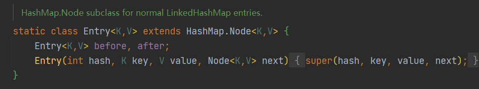

# 集合笔记

# Collection接口

Collection接口的子接口中
~~~
 List：可重复 有序
 Set：不可重复 无序
~~~

Collection接口 常用方法

~~~
add: 添加
remove: 删除
contains: 查找元素是否存在
containsAll: 查找多个元素是否都存在
size: 元素个数
isEmpty: 是否未空
clear: 清空
addAll :添加多个元素
removeAll :删除多个元素

~~~

Iterator迭代器

~~~
迭代器执行原理
Iterator iterator = coll.iterator();//得到一个集合迭代器

while(iterator.hasNext()){ // hesNext() 判断是否还有下一个元素

     iterator.next() // next() 下移一位，并将该元素返回
}

iterator迭代器遍历快捷键 itit
~~~

增强for

~~~
 增强for 就是简化版的Iterator迭代器，底层还是调用迭代器
~~~

#List接口

List接口介绍
~~~
list集合中元素有序（添加和取出顺序一致），可重复
list集合每个元素都对应索引，索引从0开始
~~~

常用方法
~~~
 get(int index)     获取指定index位置的元素
 set(int index,Object obj)  设置指定index位置的元素为obj
 indexOf(Object obj)    返回obj在集合中首次出现的位置
 lastIndexOf(Object obj)    返回obj在集合中最后一次出现的位置
 subList(int fromIndex,int toIndex)     返回从fromIndex到toIndex位置的子集合，包括前面
~~~

List接口练习
~~~
 使用 list接口实现类添加三本书，并遍历
 要求：
       1.按价格排序，从低到高（冒泡排序）
 
public class list接口练习 {
    public static void main(String[] args) {

        List list = new ArrayList();

        list.add(new Book("三国演义","罗贯中",50.0));
        list.add(new Book("红楼梦","曹雪芹",100.0));
        list.add(new Book("西游记","吴承恩",30.0));
        list.add(new Book("水浒传","施耐庵",60.0));

        for (Object o : list) {
            System.out.println(o);
        }

        System.out.println("----------------排序后");
        for (Object o : list) {
            System.out.println(o);
        }
    }

    //冒泡排序，从低到高
    public static void sort(List list){
        int size = list.size();
        for (int i = 0; i <size -1; i++) {
            for (int j = 0; j < size -i -1; j++) {
                Book book = (Book) list.get(j);
                Book book1 =(Book) list.get(j + 1);
                if (book.getPrice() > book1.getPrice()){
                    list.set(j,book1);
                    list.set(j+1,book);
                }
            }
        }
    }
}
class Book {...}
~~~

## ArrayList介绍

~~~
1.ArrayList是由 数组 来实现数据存储的
2.ArrayList等同于Vector，ArrayList是线程不安全(执行效率高)；在多线程情况下，不建议使用ArrayList
~~~

ArrayList的底层操作机制和源码分析
~~~
1.ArrayList中维护了一个Object类型的数组 elementData
2.当创建ArrayList对象时，如果使用的是无参构造器，则初始elementData的容量为0，第一次添加则扩容elementData为10，如需要再次扩容，则扩容elementData的1.5倍
3.如果使用的是指定大小的构造器，则初始elementData容量为指定大小，如果需要扩容，则直接扩容elementData的1.5倍
~~~

创建ArrayList无参构造器，初始容量elementData默认为0
~~~
ArrayList list = new ArrayList();

//1 static Object[] DEFAULTCAPACITY_EMPTY_ELEMENTDATA = {}; 静态变量
public ArrayList() {
    this.elementData = DEFAULTCAPACITY_EMPTY_ELEMENTDATA;
}
~~~

ArrayList 第一次 add()

~~~
//1 走 ensureCapacityInternal()确认内部容量方法，此时size默认为0
public boolean add(E e) {
    ensureCapacityInternal(size + 1);  // Increments modCount!!
    elementData[size++] = e;
    return true;
}

//2 先走calculateCapacity()计算需要的最小容量容量方法，如3所示，如果elementData为0，则返回最小容量minCapacity和DEFAULT_CAPACITY的较大值，
//DEFAULT_CAPACITY默认等于10
//如果elementData中有数据，则直接返回需要的最小容量
private void ensureCapacityInternal(int minCapacity) {
    ensureExplicitCapacity(calculateCapacity(elementData, minCapacity));
}

//3 calculateCapacity()
private static int calculateCapacity(Object[] elementData, int minCapacity) {
    if (elementData == DEFAULTCAPACITY_EMPTY_ELEMENTDATA) {
        return Math.max(DEFAULT_CAPACITY, minCapacity);
    }
    return minCapacity;
}

//4 ensureExplicitCapacity()，如果需要的最小容量比数组容量elementData要大，则需要扩容，执行grow()
private void ensureExplicitCapacity(int minCapacity) {
    modCount++;
    // overflow-conscious code
    if (minCapacity - elementData.length > 0)
        grow(minCapacity);
}

//5 grow()，传入需要的最小容量10，这里初始elementData为0，所以newCapcity还为10
// 如果elementData里面有值，则按elementData的1.5倍进行扩容
private void grow(int minCapacity) {
    // overflow-conscious code
    int oldCapacity = elementData.length;
    int newCapacity = oldCapacity + (oldCapacity >> 1);
    if (newCapacity - minCapacity < 0)
        newCapacity = minCapacity;
    if (newCapacity - MAX_ARRAY_SIZE > 0)
        newCapacity = hugeCapacity(minCapacity);
    // minCapacity is usually close to size, so this is a win:
    elementData = Arrays.copyOf(elementData, newCapacity);
}

~~~
最后返回到add方法，把add的值添加进行数组

.png)

ArrayList源码总结
~~~
1.创建无参构造方法时，数组的默认容量elementData设置为0
2.把需要的最小容量和数组容量进行比较，需要的最小容量比比数组容量大，则进行扩容操作
~~~

## Vector介绍
~~~
1.Vector底层也是一个对象数组，protected Object[] elementData;
2.Vector是线程同步的，即线程安全，Vector类的操作方法带有 synchronized
3.需要线程同步安全时，需要考虑使用Vector
~~~

Vector和ArrayList比较

Vector源码解析

无参构造器vector初始化后，初始容量为10
~~~
Vector vector = new Vector()

// 1.不传参数，默认走Vector的无参构造器，初始容量给 10
public Vector() {
    this(10);
}

// 2
public Vector(int initialCapacity) {
    this(initialCapacity, 0);
}
~~~

Vector扩容机制
~~~
// 1 判断扩容方法 ensureCapacityHelper(最小容量) 

public synchronized boolean add(E e) {
    modCount++;
    ensureCapacityHelper(elementCount + 1);
    elementData[elementCount++] = e;
    return true;
}

// 2 判断条件：当需要的最小容量比数组容量大时，执行grow()方法扩容

private void ensureCapacityHelper(int minCapacity) {
    if (minCapacity - elementData.length > 0)
        grow(minCapacity);
}

// 3 grow()方法

private void grow(int minCapacity) {
    int oldCapacity = elementData.length;
    int newCapacity = oldCapacity + ((capacityIncrement > 0) ?
                                     capacityIncrement : oldCapacity);
    if (newCapacity - minCapacity < 0)
        newCapacity = minCapacity;
    if (newCapacity - MAX_ARRAY_SIZE > 0)
        newCapacity = hugeCapacity(minCapacity);
    elementData = Arrays.copyOf(elementData, newCapacity);
}

~~~

## LinkedList介绍

~~~
1.LinkedList 底层实现了 双向链表 和 双端队列
2.可以添加任意元素（元素可以重复），包括null
3.线程不安全，没有实现同步
~~~

LinkedList底层结构
~~~
1.LinkedList底层维护了一个双向链表
2.LinkedList中维护了两个属性 first 和 last 分别指向首节点和尾节点
3.每个节点（Node对象），里面又维护了prev、next、item三个属性，通过prev指向前一个，通过next指向后一个，实现双向链表
4.所以LinkedList的元素增加和删除，相较于效率较高
~~~

双向链表图示

LinkedList 源码解析

LinkedList 创建无参构造器过程；此时，size为0，first、last为Null
~~~
    LinkedList linkedList = new LinkedList();

//1 走LinkedList的无参构造器 初始化 size=0
    public LinkedList() {
    }
    
//2   
    transient int size = 0;
~~~

add()方法解析（第一次添加）
~~~
linkedList.add(12);

//1 走 linkLast(e)方法
    public boolean add(E e) {
        linkLast(e);
        return true;
    }

//2 last=null，l也为null，此时first、last都指向新节点
    void linkLast(E e) {
        final Node<E> l = last;
        final Node<E> newNode = new Node<>(l, e, null);
        last = newNode;
        if (l == null)
            first = newNode;
        else
            l.next = newNode;
        size++;
        modCount++;
    }
~~~

add方法里面有值，last不为null，此时新节点的prev指向最后节点，最后节点的next指向新节点

LinkedList的remove() ，默认删除首节点

~~~
//1 走 removeFirst()方法
public E remove() {
    return removeFirst();
}

//2 第一个节点不为null，执行unlinkFirst(f)方法，删除第一个节点
public E removeFirst() {
    final Node<E> f = first;
    if (f == null)
        throw new NoSuchElementException();
    return unlinkFirst(f);
}

//3 unlinkFirst() 删除首节点f，先把f的值赋给element，再把f.next赋给一个新next节点，把f的值和next赋为空，
//此时first.next指向新next节点，再把next的prev赋为空，该操作就是把first指向首节点的next，再把首节点的prev赋为空

private E unlinkFirst(Node<E> f) {
    // assert f == first && f != null;
    final E element = f.item;
    final Node<E> next = f.next;
    f.item = null;
    f.next = null; // help GC
    first = next;
    if (next == null)
        last = null;
    else
        next.prev = null;
    size--;
    modCount++;
    return element;
}
~~~

ArrayList 和 LinkedList 比较

如何选择？
~~~
1.如果改查多，选择ArrayList
2.如果增删多，选择LinkedList
3.一般大部分都是改查，大部分情况都会选ArrayList
~~~

#set接口

~~~
1.无序（存放和取出的顺序不一致），没有索引，不能用普通for循环遍历
2.不允许重复元素，最多有一个null
3.取出的顺序固定，按hashCode排列
~~~

## HashSet介绍

~~~
1.HashSet的底层是HashMap，HashMap的底层是：数组+链表+红黑树
~~~

例：数组+链表
~~~
public class HashSet源码解析 {
    public static void main(String[] args) {

        //创建Node[] 数组
        Node[] table = new Node[16];

        //创建节点
        Node john = new Node("john", null);
        table[2] = john;
        
        Node jack = new Node("jack", null);
        
        //挂载jack到john的next
        john.next=jack;
    }
}

class Node { //节点类，存储数据，指向下一个节点
    Object item;
    Node next;
    public Node(Object item, Node next) {//有参构造
        this.item = item;
        this.next = next;
    }
}
~~~

结构图示

## HashMap介绍

~~~
1.添加一个元素时，先计算hash值，再计算出索引值
2.找到存储数据表table，判断这个索引位置是否已经存放的有元素，如果没有直接加入
3.如果有，就循环遍历链表比较是否有元素相同，如果没有就挂载到最后，如果有就不添加
4.在java8中，如果一条链表的元素个数到达 TREEIFY_THRESHOLD=8，并且table数组容量>=MIN_TREEIFY_CAPACITY = 64，就会进行树化（红黑树）
~~~

HashSet源码

HashSet执行无参构造器，new了一个HashMap
~~~
HashSet set = new HashSet();

public HashSet() {
    map = new HashMap<>();
}
~~~
执行add方法，第一次添加，数组table扩容到16，阈值threshold扩容到16*0.75=12，数组达到达阈值就会进行扩容操作
~~~
//1 执行add()方法
public boolean add(E e) {
    return map.put(e, PRESENT)==null; //static PRESENT = new Object(); PRESENT表示静态共享
}

//2 执行put()方法，hash(key)：获取hash值
public V put(K key, V value) {
    return putVal(hash(key), key, value, false, true);
}

//3 putVal()：执行resize()扩容方法，存入节点
final V putVal(int hash, K key, V value, boolean onlyIfAbsent,boolean evict) {
        //1 定义辅助变量：tab、p、n、i
        Node<K,V>[] tab; Node<K,V> p; int n, i;
        
        //Node<K,V>[] table; table等于HashMap中Node[]数组
        //2 先判断Node[]数组是否为空，如果为空，进行第一次扩容，到16个空间
        if ((tab = table) == null || (n = tab.length) == 0)
            n = (tab = resize()).length;
        
        //3 根据hash值去计算key应该存放到table的哪个索引位置
        //如果该索引位置为null，表示该索引处没有存放元素，则把新节点存放进去 Node(key="item",value="PRESENT")
        if ((p = tab[i = (n - 1) & hash]) == null)
            tab[i] = newNode(hash, key, value, null);
        else {
            //如果该索引处不为null，判断该索引处和新加节点的hash值和key是否相同，如果相同不添加，直接退出
            Node<K,V> e; K k;
            if (p.hash == hash &&
                ((k = p.key) == key || (key != null && key.equals(k))))
                e = p;
            else if (p instanceof TreeNode)
                //判断是否为红黑树
                e = ((TreeNode<K,V>)p).putTreeVal(this, tab, hash, key, value);
            else {
                //该索引处和新加节点的hash值、key不同，则循环遍历该索引处的链表，如果没有相同的值，则挂载到最后
                for (int binCount = 0; ; ++binCount) {
                    //挂载到最后，直接退出
                    if ((e = p.next) == null) {
                        p.next = newNode(hash, key, value, null);
                        //判断链表是否达到8个节点，如果达到就进行树化（红黑树），还要在treeifyBin()判断：数组容量是否达到64
                        // treeifyBin方法中判断条件：(n = tab.length) < MIN_TREEIFY_CAPACITY(64))
                        if (binCount >= TREEIFY_THRESHOLD - 1) // -1 for 1st
                            treeifyBin(tab, hash);
                        break;
                    }
                    //找到相同的值，直接退出
                    if (e.hash == hash &&
                        ((k = e.key) == key || (key != null && key.equals(k))))
                        break;
                    p = e;
                }
            }
            if (e != null) { // existing mapping for key
                V oldValue = e.value;
                if (!onlyIfAbsent || oldValue == null)
                    e.value = value;
                afterNodeAccess(e);
                return oldValue;
            }
        }
        ++modCount;
        if (++size > threshold)
            resize();
        afterNodeInsertion(evict);
        return null;
    }
    
//4 resize() 扩容方法
final Node<K,V>[] resize() {
        Node<K,V>[] oldTab = table;
        int oldCap = (oldTab == null) ? 0 : oldTab.length;
        int oldThr = threshold;
        int newCap, newThr = 0;
        if (oldCap > 0) {
            if (oldCap >= MAXIMUM_CAPACITY) {
                threshold = Integer.MAX_VALUE;
                return oldTab;
            }
            else if ((newCap = oldCap << 1) < MAXIMUM_CAPACITY &&
                     oldCap >= DEFAULT_INITIAL_CAPACITY)
                newThr = oldThr << 1; // double threshold
        }
        else if (oldThr > 0) // initial capacity was placed in threshold
            newCap = oldThr;
        else {               // zero initial threshold signifies using defaults
            newCap = DEFAULT_INITIAL_CAPACITY;
            newThr = (int)(DEFAULT_LOAD_FACTOR * DEFAULT_INITIAL_CAPACITY);
        }
        if (newThr == 0) {
            float ft = (float)newCap * loadFactor;
            newThr = (newCap < MAXIMUM_CAPACITY && ft < (float)MAXIMUM_CAPACITY ?
                      (int)ft : Integer.MAX_VALUE);
        }
        threshold = newThr;
        @SuppressWarnings({"rawtypes","unchecked"})
        Node<K,V>[] newTab = (Node<K,V>[])new Node[newCap];
        table = newTab;
        if (oldTab != null) {
            for (int j = 0; j < oldCap; ++j) {
                Node<K,V> e;
                if ((e = oldTab[j]) != null) {
                    oldTab[j] = null;
                    if (e.next == null)
                        newTab[e.hash & (newCap - 1)] = e;
                    else if (e instanceof TreeNode)
                        ((TreeNode<K,V>)e).split(this, newTab, j, oldCap);
                    else { // preserve order
                        Node<K,V> loHead = null, loTail = null;
                        Node<K,V> hiHead = null, hiTail = null;
                        Node<K,V> next;
                        do {
                            next = e.next;
                            if ((e.hash & oldCap) == 0) {
                                if (loTail == null)
                                    loHead = e;
                                else
                                    loTail.next = e;
                                loTail = e;
                            }
                            else {
                                if (hiTail == null)
                                    hiHead = e;
                                else
                                    hiTail.next = e;
                                hiTail = e;
                            }
                        } while ((e = next) != null);
                        if (loTail != null) {
                            loTail.next = null;
                            newTab[j] = loHead;
                        }
                        if (hiTail != null) {
                            hiTail.next = null;
                            newTab[j + oldCap] = hiHead;
                        }
                    }
                }
            }
        }
        return newTab;
    }

~~~

## LinkedHashSet介绍
~~~
1.LinkedHashSet 继承 HashSet，实现Set接口
2.LinkedHashSet 底层是一个 LinkedHashMap（HashMap的子类），底层维护了一个（ 数组 + 双向链表 ）
3.LinkedHashSet 根据元素的hashCode值来决定元素的存储位置，同时使用链表维护元素的次序，这使得元素看起来是以插入顺序保存的
4.LinkedHashSet不允许添加重复元素
~~~

LinkedHashMap 第一次添加，数组容量扩容到16，数组是HashMap$Node[]类型，存放的元素/数据是LinkedHashMap$Entry类型，继承关系

说明
~~~
1.在LinkedHashSet 中维护了一个hash表和双向链表(LinkedHashSet有 head 和 tail )
2.每一个节点有before和after属性，这样可以形成双向链表
3.在添加每一个元素时，先求hash值，再求索引。确认该元素在table的位置，然后将添加的元素加入到双向链表(如果存在，不添加)
4.这样遍历LinkedHashSet也能确保插入顺序和遍历顺序一样
~~~

LinkedHashMap 存储图示

# Map

